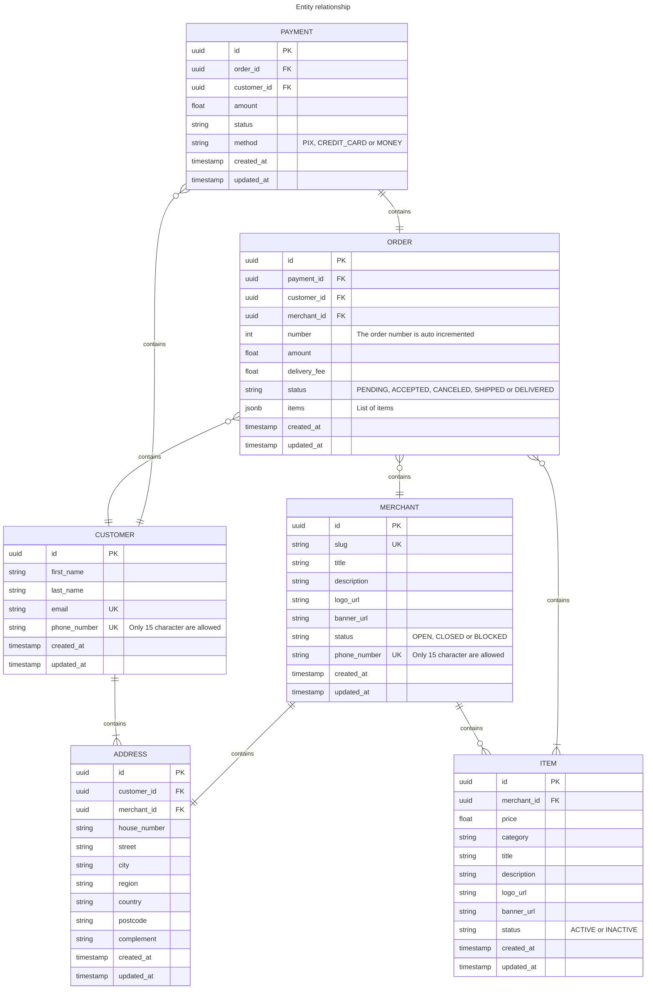

```mermaid
---
title: Entity relationship
---
erDiagram
    CUSTOMER {
      uuid id PK
      string first_name
      string last_name
      string email UK
      string phone_number UK "Only 15 character are allowed"
      timestamp created_at
      timestamp updated_at
    }

    MERCHANT {
      uuid id PK
      string slug UK
      string title
      string description
      string logo_url
      string banner_url
      string status "OPEN, CLOSED or BLOCKED"
      string phone_number UK "Only 15 character are allowed"
      timestamp created_at
      timestamp updated_at
    }
    
    ITEM {
      uuid id PK
      uuid merchant_id FK
      float price 
      string category
      string title
      string description
      string logo_url
      string banner_url
      string status "ACTIVE or INACTIVE"
      timestamp created_at
      timestamp updated_at
    }

    ADDRESS {
      uuid id PK
      uuid customer_id FK
      uuid merchant_id FK
      string house_number
      string street
      string city
      string region
      string country
      string postcode
      string complement
      timestamp created_at
      timestamp updated_at
    }

    ORDER {
      uuid id PK
      uuid payment_id FK
      uuid customer_id FK
      uuid merchant_id FK
      int number "The order number is auto incremented"
      float amount
      float delivery_fee
      string status "PENDING, ACCEPTED, CANCELED, SHIPPED or DELIVERED"
      jsonb items "List of items"
      timestamp created_at
      timestamp updated_at
    }

    PAYMENT {
      uuid id PK
      uuid order_id FK
      uuid customer_id FK
      float amount
      string status
      string method "PIX, CREDIT_CARD or MONEY"
      timestamp created_at
      timestamp updated_at
    }

    CUSTOMER ||--|{ ADDRESS: contains

    MERCHANT ||--o{ ITEM: contains
    MERCHANT ||--|| ADDRESS: contains

    ORDER }o--|| CUSTOMER: contains 
    ORDER }o--|| MERCHANT: contains
    ORDER }o--|{ ITEM: contains

    PAYMENT ||--|| ORDER: contains
    PAYMENT }o--|| CUSTOMER: contains
```