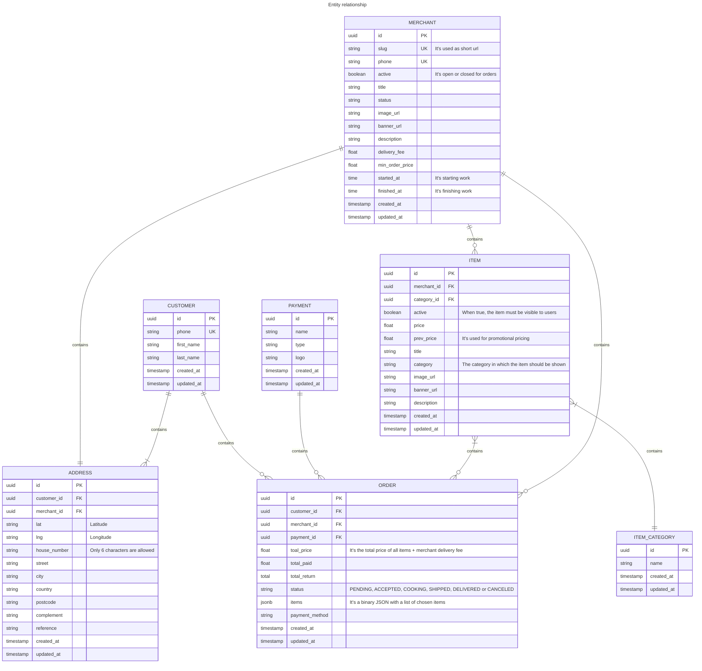

```mermaid
---
title: Entity relationship
---
erDiagram
  CUSTOMER {
    uuid      id          PK
    string    phone       UK 
    string    first_name
    string    last_name
    timestamp created_at
    timestamp updated_at
  }

  ADDRESS {
    uuid      id          PK
    uuid      customer_id FK
    uuid      merchant_id FK
    string    lat             "Latitude"
    string    lng             "Longitude"
    string    house_number    "Only 6 characters are allowed"
    string    street      
    string    city        
    string    country     
    string    postcode    
    string    complement  
    string    reference   
    timestamp created_at
    timestamp updated_at
  }

  MERCHANT {
    uuid      id                PK
    string    slug              UK  "It's used as short url"
    string    phone             UK
    boolean   active                "It's open or closed for orders"
    string    title
    string    status
    string    image_url
    string    banner_url
    string    description
    float     delivery_fee
    float     min_order_price
    time      started_at             "It's starting work"
    time      finished_at            "It's finishing work"
    timestamp created_at
    timestamp updated_at
  }
  
  ITEM {
    uuid      id            PK
    uuid      merchant_id   FK
    uuid      category_id   FK
    boolean   active            "When true, the item must be visible to users"
    float     price 
    float     prev_price        "It's used for promotional pricing"
    string    title
    string    category          "The category in which the item should be shown"
    string    image_url
    string    banner_url
    string    description
    timestamp created_at
    timestamp updated_at
  }

  ORDER {
    uuid      id             PK
    uuid      customer_id    FK
    uuid      merchant_id    FK
    uuid      payment_id     FK
    float     toal_price         "It's the total price of all items + merchant delivery fee"
    float     total_paid
    total     total_return
    string    status             "PENDING, ACCEPTED, COOKING, SHIPPED, DELIVERED or CANCELED"
    jsonb     items              "It's a binary JSON with a list of chosen items"
    string    payment_method 
    timestamp created_at
    timestamp updated_at
  }

  PAYMENT {
    uuid      id           PK
    string    name
    string    type
    string    logo
    timestamp created_at
    timestamp updated_at
  }

  ITEM_CATEGORY {
    uuid      id             PK
    string    name
    timestamp created_at
    timestamp updated_at
  }

  MERCHANT  ||--o{  ITEM:           contains
  MERCHANT  ||--||  ADDRESS:        contains
  CUSTOMER  ||--o{  ORDER:          contains
  PAYMENT   ||--o{  ORDER:          contains      
  ITEM      }|--o{  ORDER:          contains
  MERCHANT  ||--o{  ORDER:          contains
  CUSTOMER  ||--|{  ADDRESS:        contains
  ITEM      }|--||  ITEM_CATEGORY:  contains
```